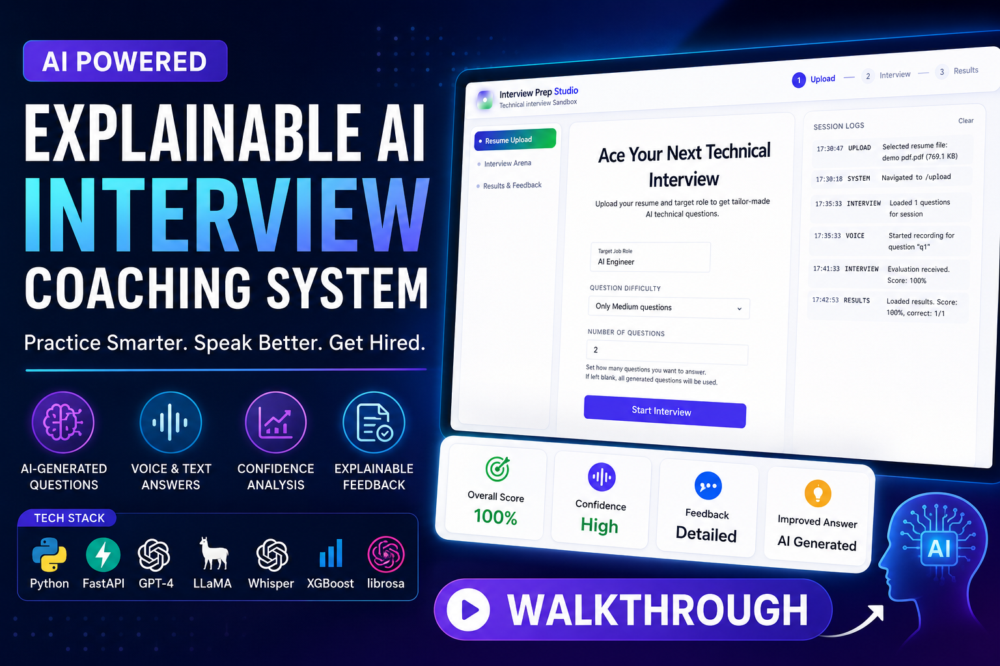

# 🎯 Explainable AI-Based Interview Coaching System

<p align="center">

### 🚀 AI-Powered Technical Interview Preparation Platform using **Gemini**, **Whisper**, **Librosa**, **XGBoost**, and **Explainable AI**

Helping candidates improve both **technical knowledge** and **communication skills** through intelligent interview simulation, speech analysis, and explainable feedback.

</p>

<br>

<p align="center">
  <a href="https://github.com/chandu5t/AI-Based-Interview-Coaching-System-">
    
  </a>

  <a href="https://youtu.be/eFAgtBS4hUQ">
    
  </a>

  

  

  

  

  

</p>

<br>

<p align="center">

**✨ Resume-Based Interview Questions • 🎤 Voice Analysis • 🤖 Gemini AI • 🧠 Explainable AI • 📈 Confidence Prediction**

</p>

---

# 🎥 Project Walkthrough

<p align="center">

Watch the complete walkthrough of the **Explainable AI-Based Interview Coaching System** to understand how AI generates interview questions, evaluates candidate responses, predicts confidence using speech analysis, and provides explainable feedback.

</p>

<p align="center">

<a href="https://youtu.be/eFAgtBS4hUQ">



</a>

</p>

<p align="center">

### ▶️ Click the thumbnail above to watch the complete project demonstration.

</p>

---

# 📸 Application Preview

<p align="center">


</p>

<p align="center">


</p>

> **Note:** Replace the image paths with your uploaded screenshots.

---

# 🏆 Badges


---

# 📖 Overview

Preparing for technical interviews requires much more than simply knowing programming concepts. Candidates are also expected to communicate effectively, explain their thought process clearly, maintain confidence, and answer questions in a structured manner.

The **Explainable AI-Based Interview Coaching System** is an intelligent interview preparation platform designed to simulate real technical interviews using **Generative AI**, **Speech Processing**, **Machine Learning**, and **Explainable AI (XAI)**.

Unlike conventional interview preparation tools that only check whether an answer is correct, our platform evaluates **both technical knowledge and communication skills**.

The application automatically generates personalized interview questions using **Google Gemini**, accepts answers in **text or voice format**, evaluates semantic correctness through Natural Language Processing, predicts speaking confidence using speech analytics, and finally provides transparent, actionable feedback to help candidates continuously improve.

The system follows a **dual-evaluation architecture**:

- 🧠 **Content Evaluation** using Large Language Models
- 🎤 **Speech Confidence Analysis** using Machine Learning

The outputs from both pipelines are combined to generate a detailed interview report with explainable insights and personalized improvement suggestions.

---

# ✨ Key Features

## 🤖 AI Interview Question Generation

- Generate personalized interview questions using **Google Gemini**
- Resume-based interview generation
- Domain-based interview preparation
- Multiple difficulty levels (Easy, Medium, Hard)
- Realistic technical interview simulation

---

## 🎤 Speech Analysis

The application evaluates speaking behavior using audio processing.

Features extracted include:

- Pitch Mean
- Pitch Variance
- Speech Rate
- Pause Count
- Average Pause Duration
- Energy Level
- Jitter
- Shimmer
- Filler Word Detection

These speech features are used to predict candidate confidence.

---

## 📈 Confidence Prediction

The speech analytics module predicts confidence using an **XGBoost Regression Model** trained on acoustic speech features.

Performance:

- ✅ R² Score: **0.932**
- ✅ Mean Absolute Error: **0.464**

# 🏗 System Architecture

The system follows a modular architecture combining **Generative AI**, **Speech Processing**, and **Machine Learning** to simulate real technical interviews and provide explainable feedback.

<p align="center">
  
</p>

### Workflow

1. Upload Resume / Select Domain
2. Gemini generates interview questions
3. Candidate answers via Text or Voice
4. Whisper converts speech to text
5. Librosa extracts speech features
6. Gemini evaluates answer quality
7. XGBoost predicts confidence score
8. AI generates explainable feedback and improved answers

---

# 📂 Project Structure

```text
AI-Based-Interview-Coaching-System/
│
└── ExplainableAI_InterviewCoach/
    ├── backend/                    # FastAPI Backend
    │   ├── main.py                 # Main API Server
    │   ├── asr_pipeline.py         # Speech Recognition & Feature Extraction
    │   └── requirements.txt        # Python Dependencies
    │
    ├── smartInterview/             # Angular Frontend
    │   ├── src/                    # Components & Pages
    │   ├── angular.json
    │   └── package.json
    │
    └── assets/
        ├── thumbnail.png           # YouTube Thumbnail
        ├── architecture.png        # System Architecture
        └── research_paper.pdf      # Research Paper
```

---

# 🛠 Tech Stack

| Category | Technologies |
|----------|--------------|
| Frontend | React.js |
| Backend | FastAPI |
| Language | Python |
| LLM | Google Gemini |
| Speech-to-Text | Whisper |
| Speech Processing | Librosa |
| NLP | spaCy |
| Machine Learning | XGBoost |
| Database | MongoDB |
| Tools | Git, GitHub, VS Code |

---

# ⭐ Core Features

- 🤖 Resume & Domain-Based Interview Question Generation
- 📝 AI-Powered Answer Evaluation
- 🎤 Voice & Text Interview Support
- 🔊 Speech Feature Extraction using Librosa
- 🎙 Speech-to-Text using Whisper
- 📈 Confidence Prediction using XGBoost
- 🧠 Explainable AI Feedback
- 💡 AI-Generated Improved Answers
- 📊 Interview Performance Dashboard

---

# ⚙️ Installation & Setup

### Prerequisites

- Python 3.10+
- Node.js 18+
- Git

---

### 1️⃣ Clone the Repository

```bash
git clone https://github.com/chandu5t/AI-Based-Interview-Coaching-System-.git
cd AI-Based-Interview-Coaching-System
cd ExplainableAI_InterviewCoach
```

---

### 2️⃣ Frontend Setup (Angular)

```bash
cd smartInterview
npm install
ng serve
```

The application will be available at:

```
http://localhost:4200
```

---

### 3️⃣ Backend Setup (FastAPI)

```bash
cd ../backend
pip install -r requirements.txt
uvicorn main:app --reload
```

The backend server will start at:

```
http://127.0.0.1:8000
```

---

### 4️⃣ Configure Environment Variables

Create a `.env` file inside the **backend** directory and add your credentials:

```env
GEMINI_API_KEY=your_gemini_api_key
```

> Configure your **Gemini API Key** and database credentials in the `.env` file before running the application.

---

# 🤖 AI Pipeline

**Resume/Domain → Gemini → Interview Questions → Candidate Response → Whisper (Speech-to-Text) → Librosa (Feature Extraction) → Gemini (Answer Evaluation) → XGBoost (Confidence Prediction) → Explainable AI Feedback**

---

# 📊 Model Performance

| Model | MAE | R² Score |
|------|------:|------:|
| **XGBoost** | **0.464** | **0.932** |
| MLP | 0.472 | 0.932 |
| Random Forest | 0.477 | 0.928 |
| Ridge Regression | 0.676 | 0.887 |

---
## 📄 Research Paper

**"Explainable AI-Based Interview Coaching System"**

📄 [Read the Research Paper](./ExplainableAI_InterviewCoach/assets/research_paper.pdf) 

---

# 🚀 Future Enhancements

- 🌍 Multi-language interview support
- 📹 Real-time video interview analysis
- 😊 Facial emotion recognition
- 📈 Personalized learning recommendations
- ☁️ Cloud deployment and scalable architecture


---

# 👨‍💻 Contributors

- **Chandrakant Thakare**
- **Yash Maske**
- **Sakshi Lokhande**
- **Shubhankar Jakate**

**Department of Computer Science & Engineering (AI)**  
**Vishwakarma Institute of Information Technology, Pune**

---

# 📜 License

This project is licensed under the **MIT License**. Feel free to use, modify, and contribute.

---

# ⭐ Support

If you found this project useful, please consider:

⭐ Star this repository

🍴 Fork the project

📺 Watch the YouTube Demo

💬 Share your feedback

---

# 🙏 Acknowledgements

We sincerely thank **Vishwakarma Institute of Information Technology (VIIT), Pune**, our project mentors, and the open-source community for their guidance and support throughout the development of this project.

---

<p align="center">

**Made with ❤️ using Gemini AI, Whisper, Librosa, XGBoost, FastAPI & React**

</p>


---
